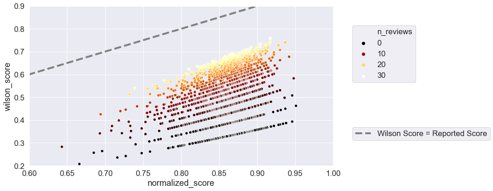

# Whiskey Neat

In the United States, whisk([e](https://en.wikipedia.org/wiki/Whisky#Names_and_spellings))y has seen a [massive resurgence in popularity in the past decade](https://trulyexperiences.com/blog/when-did-american-whiskey-get-so-popular/). Alongside the boost in popularity, several collections of reviews have popped up online, including [Selfbuilt's Whisky Analysis]() and the [Scotch](https://www.reddit.com/r/Scotch/) and [Bourbon](https://www.reddit.com/r/Bourbon/) reddit communities.

Neat!

Let's play around with them.

## Wilson Score-Adjusted Ratings
Exploring a rating metric that accounts for the number of reviews for each item.

